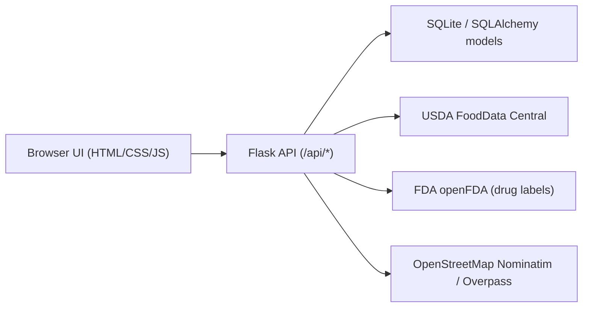

# Meal Plan Autopilot

Pantry-aware, macro-constrained weekly meal planning for normal people.

Meal Plan Autopilot is a full-stack web app that generates a weekly meal plan using:
- ingredients you already have
- your dietary constraints
- your macro targets

It then produces an aggregated shopping list, surfaces explainable planning decisions, and includes medication/supplement informational checks using public FDA label data.

## Live links

- Live demo: `add-your-render-url-here`
- Source code: `add-your-github-url-here`
- Health check: `<your-render-url>/healthz`

## Why this project exists

Most meal tools are recipe browsers. This project is a decision engine:
- It optimizes for pantry reuse.
- It enforces diet/allergen constraints.
- It scores recipes against macro targets.
- It explains why each recommendation was selected.

## Core product capabilities

### 1) Pantry management
- Add pantry items from USDA search results or manual entries.
- Store normalized gram quantities with display units.
- Merge repeated food additions into existing pantry rows.

### 2) Preference and macro constraints
- Diet tags (for example: vegetarian, halal, gluten-free).
- Allergen/dislike blocking.
- Daily calorie and macro range targets (protein/carbs/fat min/max).

### 3) Weekly plan generation (algorithmic core)
- Candidate recipes are filtered by constraints.
- Recipes are scored by pantry coverage and macro fit.
- Variety bonus reduces repeated main proteins.
- Greedy day-by-day selection consumes pantry quantities over the week.

### 4) Explainability
Each planned day includes:
- macro profile
- pantry usage percentage
- score + macro error
- short explanation string describing why the meal was selected

### 5) Shopping list generation
- Computes missing ingredients from selected recipes vs pantry inventory.
- Returns aggregated quantities (grams) and per-item deficits.

### 6) Food lookup + caching behavior
- Local DB search first.
- USDA FoodData Central enrichment when API key is available.
- Remote errors/rate limits are surfaced as metadata for graceful UI handling.

### 7) Medications and supplements (informational-only)
- Uses FDA openFDA label data to gather interaction/diet/nutrient signals.
- Includes disclaimers and clinician handoff text by design.
- Avoids prescriptive medical directives.

### 8) Smart shopping and location intelligence
- Uses location-aware nearby store discovery (OSM Nominatim).
- Builds budget/tradeoff recommendation options.
- Returns strategy-ranked store plans and estimated basket totals.

## Architecture



### Backend modules

- `app/routes/ui.py`
  - `GET /` app shell
  - `GET /healthz` health endpoint
- `app/routes/meal.py`
  - API endpoints for pantry/preferences/macros/plan generation/lookup/recommendations
- `app/services/meal_planner.py`
  - day-by-day selection logic with pantry consumption
- `app/services/recipe_filter.py`
  - filtering and scoring primitives
- `app/services/food_lookup.py`
  - local + USDA search, merge, and rank
- `app/services/drug_interactions.py`
  - FDA label lookup and interaction/diet signal extraction
- `app/services/smart_shopping.py`
  - budget-aware store recommendation strategies
- `app/services/store_locator.py`
  - nearby store discovery and profiling
- `app/services/restaurant_finder.py`
  - restaurant ranking module (API surface available)
- `app/services/geocoding.py`
  - address/location geocoding

## Data model

Main SQLAlchemy models (`app/models.py`):

- `FoodItem`
  - canonical food record, macro values per 100g, optional USDA `fdc_id`
- `PantryItem`
  - inventory quantity in grams + display unit/quantity
- `Recipe`
  - recipe metadata, diet tags, macros per serving
- `RecipeIngredient`
  - recipe-to-food many-to-many join with grams per ingredient
- `UserPreferences`
  - persisted diet tags, allergens, dislikes
- `MacroTarget`
  - calories + macro min/max targets
- `GeneratedPlan`
  - history of generation events

## Planning algorithm details

Scoring logic (from `app/services/recipe_filter.py`):

```text
coverage = covered_ingredients / total_ingredients
macro_error = |protein - protein_target| + |carbs - carbs_target| + |fat - fat_target|
score = (coverage * 3.0) - (macro_error * 0.5) + variety_bonus
```

Generation loop (from `app/services/meal_planner.py`):
1. Load recipes and filter by user constraints.
2. For each day, score each candidate with current pantry state.
3. Select highest-scoring recipe.
4. Consume pantry grams for selected ingredients.
5. Repeat for requested day count.
6. Build macro summary and shopping list from selected recipes.

Variety behavior:
- first use of a protein gets a positive bonus
- repeated proteins get reduced/negative bonus
- repeated exact recipes receive an additional penalty

## API reference

### UI and health
- `GET /`
- `GET /healthz`

### Bootstrap and lookup
- `GET /api/bootstrap`
- `GET /api/foods/search?q=<term>&limit=<1..50>&page=<1..50>`
- `POST /api/location/geocode`

### Pantry
- `GET /api/pantry`
- `POST /api/pantry`
- `PUT /api/pantry/<id>`
- `DELETE /api/pantry/<id>`

### Preferences and targets
- `GET /api/preferences`
- `PUT /api/preferences`
- `GET /api/macro-target`
- `PUT /api/macro-target`

### Recipes and planning
- `GET /api/recipes`
- `POST /api/meal-plan/generate`

### Safety and recommendations
- `POST /api/interactions/check`
- `POST /api/shopping/recommend`
- `POST /api/restaurants/recommend`

## Local development

```bash
cd "/Users/siddus/Documents/UVAWork/Career/Projects/New project"
python3 -m venv .venv
source .venv/bin/activate
python3 -m pip install -r requirements.txt
cp .env.example .env
python3 run.py
```

Open: [http://127.0.0.1:5000](http://127.0.0.1:5000)

## Environment configuration

From `.env.example`:

- `FLASK_ENV=development`
- `FLASK_DEBUG=1`
- `SECRET_KEY=change-me`
- `DATABASE_URL=sqlite:///meal_autopilot.db`
- `AUTO_CREATE_TABLES=true`
- `AUTO_SEED_DATA=true`
- `AUTO_SEED_DEMO_PANTRY=false`
- `USDA_API_KEY=DEMO_KEY`

Notes:
- If `USDA_API_KEY` is blank, service falls back to `DEMO_KEY`.
- `DATABASE_URL` supports `postgresql://...` and normalizes `postgres://...` automatically.

## Deployment (Render)

This repo already includes `render.yaml` and `Procfile`.

### Fast path (Blueprint)
1. Push to GitHub.
2. In Render, choose `New +` -> `Blueprint`.
3. Select this repo.
4. Blueprint path: `render.yaml`.
5. Deploy and share resulting public URL.

### Runtime behavior on Render
- Start command uses Gunicorn:
  - `gunicorn run:app --bind 0.0.0.0:$PORT --workers 2 --threads 4 --timeout 120 --worker-tmp-dir /tmp`
- Default free-tier DB target in blueprint:
  - `sqlite:////tmp/meal_autopilot.db`
- Data in `/tmp` is ephemeral across restarts/redeploys.

## Testing

```bash
source .venv/bin/activate
PYTHONPYCACHEPREFIX=/tmp/pycache pytest -q
```

Current test suite validates:
- endpoint contracts and status/error paths
- planner behavior and scoring outcomes
- service-level logic (lookup, constraints, recommendations)
- seed idempotency and bootstrap behavior
- UI route integrity

## Tradeoffs and limitations

- USDA `DEMO_KEY` can be rate-limited; production key improves coverage.
- Store and restaurant availability/menu information is inferred from public map data and may be incomplete.
- Drug/supplement checks are informational and derived from labeling text; not medical advice.
- SQLite in `/tmp` on free hosting is good for demoing, not durable production storage.

## Recruiter/interviewer demo script (2-3 minutes)

1. Open app and add pantry items from search.
2. Set preferences and macro targets.
3. Generate weekly plan and open Plan Studio.
4. Show a manual swap and updated explanation.
5. Open Smart Shopping and run recommendations.
6. Open medication/supplement checks and point out informational disclaimers.

## Resume-friendly summary

Built a full-stack pantry-aware meal planning system (Flask + JS) that generates macro-constrained weekly plans with explainable scoring, integrates USDA/FDA/OSM data with caching and graceful fallbacks, and deploys as a public interview-ready web app.
